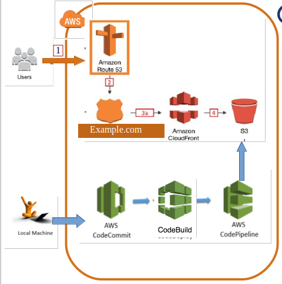

## StaticWebsiteOnAWS

Terraform code to provision infrastructure on AWS for Angular frontEnd website that will be host in S3 bucket.
Multiple environment can be provision using the same code.

## AWS Resources that will be used:

- Route53
- SSL Certificate to be used in cloudfront (Redirect all Http to Https requests)
- Cloudfront
- S3 Bucket (s3 bucker for the website per environment & s3 bucket for pipelines artifacts)
- CodeCommit ,CodeBuild & Code Pipeline
- AWS IAM Role

## Architecture

